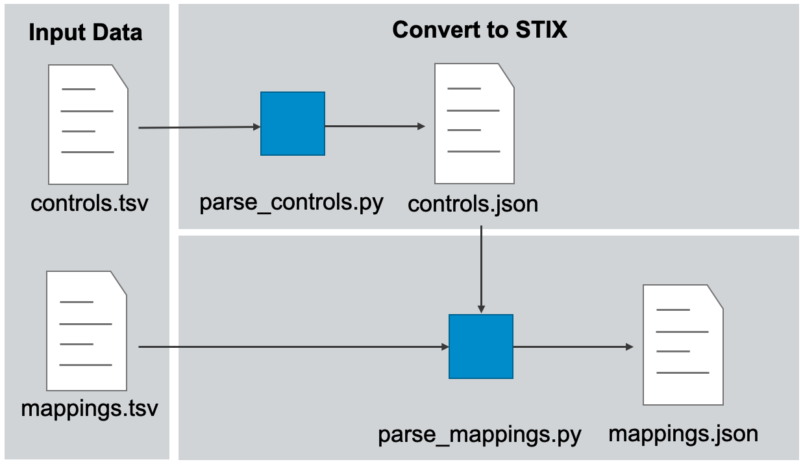

# Tooling
This document describes the python tools supplied to support the creation of new mappings or the customization of existing mappings. The scripts in this repository are provided in case users want to extend the mappings locally and need to rebuild the artifacts. If you are simply ingesting the data from this repository, you likely will not need to install or run any scripts.

## Install

### Requirements

- [python](https://www.python.org/) 3.6 or greater

### Environment setup

From the root directory of this repository:
1. Create a virtual environment: 
    - macOS and Linux: `python -m venv env`
    - Windows: `py -m venv env`
2. Activate the virtual environment: 
    - macOS and Linux: `source env/bin/activate`
    - Windows: `env/Scripts/activate.bat`
3. Install requirement packages: `pip install -r requirements/requirements.txt`

## Usage

## Rebuilding the STIX data

To rebuild all the data in the repository based on the most up-to-date input data, run `python make.py` within the [src](/src/) directory of the repository.

To rebuild the STIX data for a specific control framework:
1. run `python parser.py` from within the folder of the given control framework. This will rebuild the raw STIX data from the input spreadsheets.
2. Then use the scripts in [src](/src/) to regenerate the ancillary control data such as ATT&CK Navigator layers.

## Utility scripts

The [/src/](/src/) folder includes utility scripts designed to work with generic control frameworks and mappings that implement the format described in [the STIX format document](/docs/STIX_format.md). Please see the readme in the util folder for more details of the functionality of these scripts. The output of these scripts is already present within the framework folders; the scripts are provided for users who wish to extend or otherwise modify the defined mappings and need to rebuild the artifacts provided by this repository.

## Tooling Architecture 
If you wish to extend or otherwise modify the mappings provided in this repository, the data in the `/input/` folder of the framework may be modified. The python scripts provided in this repository transform this input data into the various output formats listed above. Please see the [install](#install) section for more on how to set up this repository for local use if you intend to extend the defined mappings. 

### Input Data
Each control framework has one input for the controls and one for the mappings. The controls input is generally supplied by the organization publishing the controls in the first place. The mappings input data were created as part of this project. 

The input mappings spreadsheets developed for this project use regular expressions for the techniqueID and controlID columns which allows for easier mapping to control families and sub-techniques. 

### Framework Parser

*Above: overview of the parser structure*

The framework parser consists of two major parts, `parse_controls.py` and the `parse_mappings.py`. These are coupled together with `parse.py` which performs both operations sequentially. 
- `parse_controls.py` takes as input the controls spreadsheet and builds a STIX2.0 representation of the control framework. Because the representation of each control framework differs, this script will likely have to be rewritten for new additional control frameworks since the input data format is not standardized.
- `parse_mappings.py` takes as input the mappings spreadsheet, and the STIX representation of the control framework and builds a STIX2.0 representation of the mappings to ATT&CK. Because the input mappings file format can be standardized, this parser can often be reused when adding additional control frameworks.

### Output data

The controls parser system outlined above produces a series of STIX2.0 bundles representing the control framework as well as mappings to ATT&CK. See the README of the `stix` folder for a given framework for a description of each file:
- [NIST 800-53 Revision 4 STIX data](/frameworks/nist800-53-r4/stix/)
- [NIST 800-53 Revision 5 STIX data](/frameworks/nist800-53-r5/stix/)

See also the [STIX Format](/docs/STIX_format.md) document for more information about the representation of controls and mappings in STIX.

## See also
- [STIX Format](/docs/STIX_format.md) for more information about the STIX representation of the controls and mappings.
- [Visualization](/docs/visualization.md) for more information about how to visualize the mappings.
